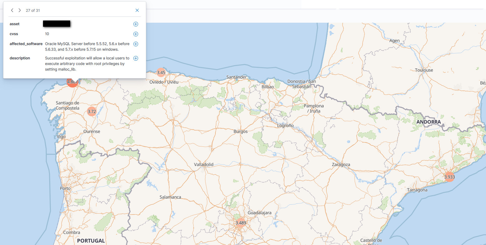
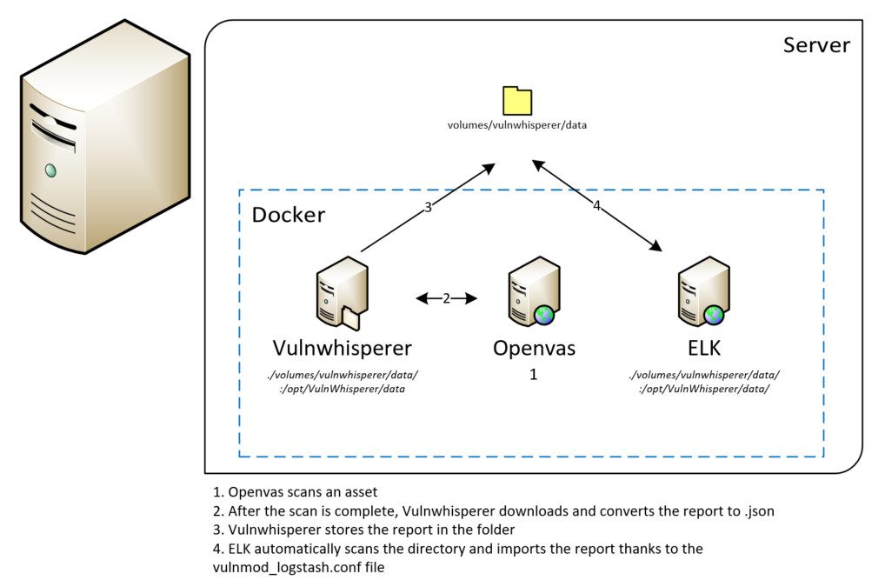

# iSOC 

Deploy an "illegal" SOC (Security Operations Center) to audit all the servers in your city in a few minutes. 

[](https://twitter.com/alexfrancow) [](https://www.linkedin.com/in/alexfrancow) [](https://www.linkedin.com/in/jlopezprado/)

<p align="center"></p>

## Requirements

Tested on:
- Debian 10
- Docker-compose version 1.25.4, build 8d51620a
- Docker 19.03.6
- Python 3.7.3

```bash
$ sudo apt update
# Docker
$ sudo apt install apt-transport-https ca-certificates curl gnupg2 software-properties-common
$ curl -fsSL https://download.docker.com/linux/debian/gpg | sudo apt-key add -
$ sudo add-apt-repository "deb [arch=amd64] https://download.docker.com/linux/debian $(lsb_release -cs) stable"
$ sudo apt update
$ apt-cache policy docker-ce
$ sudo apt install docker-ce
$ sudo systemctl status docker
$ sudo usermod -aG docker ${USER}
$ su - ${USER}
$ id -nG
$ sudo usermod -aG docker username
$ docker -v
# Docker-compose
$ curl -L "https://github.com/docker/compose/releases/download/1.25.4/docker-compose-$(uname -s)-$(uname -m)" -o /usr/local/bin/docker-compose
$ chmod +x /usr/local/bin/docker-compose
$ ln -s /usr/local/bin/docker-compose /usr/bin/docker-compose
$ docker-compose --version
# Python libraries
$ apt install python3-pip
$ pip3 install -r requirements.txt
# System requirements
$ apt install nmap masscan
# Virtual memory to Elasticsearch
$ sysctl -w vm.max_map_count=262144 or $ echo "vm.max_map_count=262144" >> /etc/sysctl.conf

```

Configure openvas to avoid: "The request contained an unknown or invalid Host header. If you are trying to access GSA via its hostname or a proxy, make sure GSA is set up to allow it." error.
```
$ nano docker-compose.yml
  openvas:
    image: mikesplain/openvas
    container_name: openvas
    environment:
      - PUBLIC_HOSTNAME=<IP>
```

Test manually the containers:

```
$ docker-compose up
Recreating openvas     ... done
Starting vulnwhisperer ... done
Starting zabbix        ... done
Starting elk           ... done

Press Ctrl+C to stop

$ docker ps
CONTAINER ID        IMAGE                     COMMAND                  CREATED             STATUS
     PORTS                                                                                        NAMES
3c8b576943a0        mikesplain/openvas        "/bin/sh -c /start"      50 seconds ago      Up 48 seconds
     0.0.0.0:443->443/tcp, 0.0.0.0:9390->9390/tcp                                                 openvas 8cb886882bdd        sebp/elk                  "/usr/local/bin/star…"   7 minutes ago       Up 48 seconds
     0.0.0.0:5044->5044/tcp, 0.0.0.0:5601->5601/tcp, 9300/tcp, 0.0.0.0:9200->9200/tcp, 9600/tcp   elk
180c993b21ac        zabbix/zabbix-appliance   "/sbin/tini -- /usr/…"   7 minutes ago       Up 49 seconds
     0.0.0.0:80->80/tcp, 0.0.0.0:10051->10051/tcp, 443/tcp

```

## Getting started

```bash
$ cat data/maxmind/database.tar.gz.parta* > data/maxmind/database.tar.gz
$ tar -zxvf data/maxmind/database.tar.gz
$ python3 Main.py
[i] Checking requirements..
[i] Starting containers..
[i] Logs: $ docker-compose logs -f
Creating network "isoc_esnet" with the default driver
Creating network "isoc_default" with the default driver
Creating elk           ... done
Creating openvas       ... done
Creating zabbix        ... done
Creating vulnwhisperer ... done
[i] Waiting for zabbix to be up..
    [*] Zabbix is up!
    [*] Installing requirements
[i] Waiting for kibana to be up..
    [*] Kibana is up!
[i] Importing templates..
    resources/zabbix/templates/template_app_service_ports.xml
    resources/zabbix/templates/main-template.xml
[i] Importing actions..
    resources/zabbix/actions/run-scan-port-80.json
[i] Creating openvas index..
[i] Getting IPs from maxmind database
[i] Importing hosts..
    192.168.1.13
    ...
```

## Options

- **Custom Zabbix Actions/Templates**: If you want to edit or import a new template or action, you can place it in "resources/zabbix/templates/" or "resources/zabbix/actions/".


## Troubleshooting

### Scan reports

<p align="center"></p>

To launch an openvas report conversion manually, we will start the vulnwhisperer container:

```bash
$ docker-compose up vulnwhisperer
Starting vulnwhisperer ... done
Attaching to vulnwhisperer
vulnwhisperer       | WARNING: No section was specified, vulnwhisperer will scrape enabled modules from config file.
vulnwhisperer       | Please specify a section using -s.
vulnwhisperer       | Example vuln_whisperer -c config.ini -s nessus
vulnwhisperer       | INFO:root:main:No section was specified, vulnwhisperer will scrape enabled modules from the config file.
vulnwhisperer       | INFO:vulnWhispererBase:__init__:Connected to database at /opt/VulnWhisperer/data/database/report_tracker.db
vulnwhisperer       | INFO:vulnWhispererOpenVAS:directory_check:Directory already exist for /opt/VulnWhisperer/data/ - Skipping creation
vulnwhisperer       | INFO:OpenVAS_API:get_reports:Retreiving OpenVAS report data...
vulnwhisperer       | INFO:OpenVAS_API:get_report_formats:Retrieving available report formats
vulnwhisperer       | INFO:vulnWhispererOpenVAS:identify_scans_to_process:Identified 3 scans to be processed
vulnwhisperer       | INFO:vulnWhispererOpenVAS:process_openvas_scans:Processing 1/3 - Report ID: e3326680-afef-4292-897e-775a35dc6dba
```

The ELK container has shared the file 'resources/vulnwhisperer/vulnmod_logstash.conf' which is in charge of parsing the .json from the openvas report, to verify that this file is in the ELK container, we start the container interactively:

```bash
$ docker exec -it elk bash
$ vi /etc/logstash/conf.d/vulnmod_logstash.conf
	input {
  	    file {
  		path => "/opt/VulnWhisperer/data/*.json"
```

If we make an 'ls' of that folder we have to see our reports.

```bash 
$ ls /opt/VulnWhisperer/data/*.json
/opt/VulnWhisperer/data/openvas_scan_25826d5a471c444e941f942a771537f6_1584732168.json
/opt/VulnWhisperer/data/openvas_scan_5b0204d06b3d4a469389acb4ba4f6b31_1584647458.json
/opt/VulnWhisperer/data/openvas_scan_e3326680afef4292897e775a35dc6dba_1584647468.json
```

We can see in kibana how the data has been parsed with a previously created index:

```bash
logstash-vulnwhisperer-*
```
You can create it with:

```bash
curl -f -XPOST -H 'Content-Type: application/json' -H 'kbn-xsrf: anything' 'http://192.168.1.13:5601/api/saved_objects/index-pattern/logstash-*' '-d{"attributes":{"title":"logstash-*"}}'
```

If you don't have any data to can create an Index you can refresh the logs manually with logstash use, first of all you must have logs in "/opt/VulnWhisperer/data/" directory and execute:

```bash 
$ /opt/logstash/bin/logstash -f /etc/logstash/conf.d/vulnmod_logstash.conf --config.reload.automatic
```

#### Add Geo information

In the "/etc/logstash/conf.d/vulnmod_logstash.conf" file you can add the geoip function to localize your asset, in our case the asset is the IP:

```bash
    grok {
        match => { "path" => "openvas_scan_%{DATA:scan_id}_%{INT:last_updated}.json$" }
        tag_on_failure => []
    }

    geoip {
        source => "asset"
    }
```

### Zabbix Disvover (Ports):

There is a script ```resources/zabbix/externalscripts/tcp-discovery.sh``` that can scan the target, to attach this script to any host you must add the host into the ```Template App Service Ports``` template once you get it you will see in the Problems tab the open ports of the host.

There is another script ```resources/zabbix/externalscripts/port_to_mongo.py``` that runs with an action, when the previous script find any port the trigger activate the  ```Port to mongoDB``` action, this script will make a $pull/$push requests to the mongoDB and will add or delete the port.


```bash
# Add port
$ python3 port_to_mongo.py -i 213.60.47.175 -pA 'Status of port 80 tcp http'
$ python3 mongo_queries.py
{'_id': ObjectId('5f46fcb743f600b9b8dae84c'), 'ip': '213.60.47.175', 'time_added': '27/08/2020', 'host_up': 'Yes', 'zip_code': '15009', 'lat': 42.3749, 'lng': -7.8049, 'place_name': 'A Coruña, Casanova De Eiris, Curramontes, Monserrat (Avenida)', 'network': '213.60.47.0/24', 'city': 'A Coruña', 'iso_code': 'ES', 'ports': ['80']}

# Delete port
$ python3 port_to_mongo.py -i 213.60.47.175 -pD 'Status of port 80 tcp http'
$ python3 mongo_queries.py
{'_id': ObjectId('5f46fcb743f600b9b8dae84c'), 'ip': '213.60.47.175', 'time_added': '27/08/2020', 'host_up': 'Yes', 'zip_code': '15009', 'lat': 42.3749, 'lng': -7.8049, 'place_name': 'A Coruña, Casanova De Eiris, Curramontes, Monserrat (Avenida)', 'network': '213.60.47.0/24', 'city': 'A Coruña', 'iso_code': 'ES', 'ports': []}
```

You must edit the ```port_to_mongo.py``` script and make sure that the mongoDB IP it's correct:

```python
client = MongoClient("192.168.1.129",
                username="alexfrancow",
                password="abc123",
                maxPoolSize=50)
```

### Zabbix Discover logs:

```bash
$ docker ps
$ docker logs -f zabbix | grep discover
line 5: nmap: command not found

# The normal error
$ docker exec -it zabbix bash
bash-5.0# apk add nmap
fetch http://dl-cdn.alpinelinux.org/alpine/v3.10/main/x86_64/APKINDEX.tar.gz
fetch http://dl-cdn.alpinelinux.org/alpine/v3.10/community/x86_64/APKINDEX.tar.gz
(1/3) Installing lua5.3-libs (5.3.5-r2)
(2/3) Installing libpcap (1.9.1-r0)
(3/3) Installing nmap (7.70-r4)
Executing busybox-1.30.1-r3.trigger
OK: 346 MiB in 119 packages

# And
$ docker logs -f zabbix | grep discover
zabbix              |    346:20200321:172546.188 discovery rule "46.24.171.21:tcp-discovery.sh[{HOST.CONN}]" became supported
```

You can save the logs into file editing the ```/etc/zabbix/zabbix_server.conf```:

```bash
### Option: LogType
#       Specifies where log messages are written to:
#               system  - syslog
#               file    - file specified with LogFile parameter
#               console - standard output
#
# Mandatory: no
# Default:
# LogType=console
LogType=file

### Option: LogFile
#       Log file name for LogType 'file' parameter.
#
# Mandatory: yes, if LogType is set to file, otherwise no
# Default:
LogFile=/var/log/zabbix.log
```

### Zabbix zbx_mem_malloc(): out of memory 

My city has a lot of hosts (>20958) found and it crashes, you must increase the CacheSize on ZABBIX container with this variable in the "docker-compose.yml":

```bash
ZBX_CACHESIZE=2000M
```

### Zabbix php_value memory_limit

Increase the MEMORYLIMIT on ZABBIX container with this variable in the "docker-compose.yml":

``` Fatal error: Allowed memory size of 134217728 bytes exhausted (tried to allocate 20480 bytes) in /usr/share/zabbix/include/classes/api/CRelationMap.php on line 77```

```bash
ZBX_MEMORYLIMIT=512M
```

### Openvas NVT:

```bash
$ docker ps
$ docker logs -f openvas
```

## Errors

If you get an openvas login error when it starts, you must delete the files inside 'volumes/openvas' directory.


## External Documentation

- ELK: https://elk-docker.readthedocs.io/
- Openvas: https://hub.docker.com/r/mikesplain/openvas/dockerfile
- Zabbix: https://www.zabbix.com/documentation/current/manual
- Vulnwhisperer: https://github.com/HASecuritySolutions/VulnWhisperer/wiki/docker-compose-Instructions
